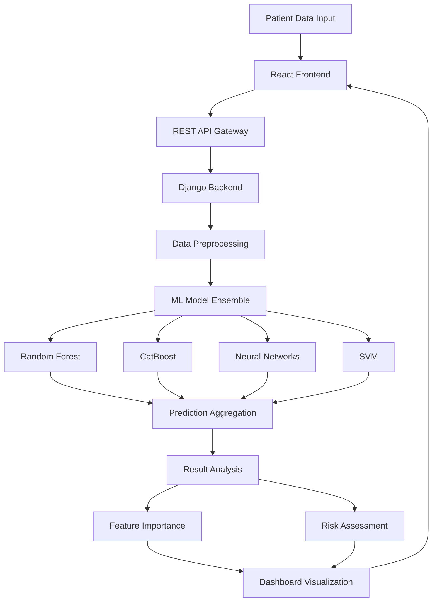

<div align="center">

# 🏥 Liver Disease Prediction System

### *AI-Powered Early Detection & Classification Platform*

[](https://opensource.org/licenses/MIT)
[](https://reactjs.org/)
[](https://www.python.org/)
[](https://www.djangoproject.com/)
[](http://makeapullrequest.com)

*A comprehensive predictive analytics system leveraging machine learning and deep learning for enhanced liver disease diagnosis and patient care.*

[Features](#-key-features) • [Demo](#-demo) • [Installation](#-installation--setup) • [Usage](#-usage) • [Models](#-machine-learning-models) • [Contributing](#-contributing)

</div>

---

## 📖 Table of Contents

- [Overview](#-project-overview)
- [Key Features](#-key-features)
- [Technology Stack](#-technology-stack)
- [System Architecture](#-system-architecture)
- [Installation & Setup](#-installation--setup)
- [Usage Guide](#-usage)
- [Clinical Parameters](#-clinical-parameters)
- [Machine Learning Models](#-machine-learning-models)
- [API Documentation](#-api-documentation)
- [Contributing](#-contributing)
- [Roadmap](#-roadmap)
- [License](#-license)
- [Acknowledgments](#-acknowledgments)
- [Contact](#-contact)

---

## 🎯 Project Overview

The **Liver Disease Prediction System** is an advanced healthcare analytics platform designed to assist medical professionals in early detection and classification of liver diseases. By analyzing clinical parameters through state-of-the-art machine learning algorithms, the system provides:

- 🔍 **Early Detection** of hepatitis, cirrhosis, and fatty liver disease
- 📊 **Severity Classification** with disease progression analysis
- 🧠 **Interpretable AI** with transparent feature importance
- ⚡ **Real-time Predictions** for immediate clinical insights
- 📱 **Responsive Interface** accessible across all devices

### 🎓 Academic Context

This project is developed as part of the **Bachelor of Technology** degree in Information Technology at **Sathyabama Institute of Science and Technology** under the guidance of **Mr. V. Saravanakumar M.E., Ph.D.**

---

## ✨ Key Features

<table>
<tr>
<td width="50%">

### 🩺 Clinical Intelligence
- Multi-parameter analysis of liver function tests
- Historical patient data tracking
- Risk factor assessment
- Disease progression monitoring

</td>
<td width="50%">

### 🤖 AI/ML Capabilities
- 7+ trained ML/DL models
- Ensemble learning approach
- Feature importance visualization
- Model explainability (SHAP values)

</td>
</tr>
<tr>
<td width="50%">

### 💻 User Experience
- Intuitive web interface
- Real-time result generation
- Visual analytics dashboard
- Mobile-responsive design

</td>
<td width="50%">

### 🔒 Security & Compliance
- HIPAA-compliant data handling
- Secure patient information storage
- Role-based access control
- Audit logging system

</td>
</tr>
</table>

---

## 🛠️ Technology Stack

### Frontend Architecture

```
React.js 18.x
├── UI Framework: React with Hooks
├── Styling: CSS3 + CSS Modules
├── State Management: Context API / Redux
├── HTTP Client: Axios
├── Charts: Recharts / Chart.js
└── Form Validation: Formik + Yup
```

### Backend Architecture

```
Django 4.x
├── REST Framework: Django REST Framework
├── Database: SQLite3 (Development) / PostgreSQL (Production)
├── Authentication: JWT
├── ML Pipeline: scikit-learn + TensorFlow
└── API Documentation: Swagger/OpenAPI
```

### Machine Learning Stack

```
Python 3.8+
├── ML Libraries: scikit-learn, XGBoost, CatBoost
├── DL Frameworks: TensorFlow, Keras
├── Data Processing: pandas, NumPy
├── Visualization: Matplotlib, Seaborn
└── Model Explainability: SHAP, LIME
```

---

## 🏗️ System Architecture



---

## 🚀 Installation & Setup

### Prerequisites

Ensure you have the following installed:

- **Node.js** (v14.0.0 or higher) - [Download](https://nodejs.org/)
- **npm** (v6.0.0 or higher) or **yarn** (v1.22.0 or higher)
- **Python** (v3.8 or higher) - [Download](https://www.python.org/)
- **pip** (v20.0.0 or higher)
- **Git** - [Download](https://git-scm.com/)

### Frontend Setup

```bash
# Clone the repository
git clone https://github.com/your-username/liver-disease-predictor.git
cd liver-disease-predictor

# Install frontend dependencies
npm install

# Create environment file
cp .env.example .env

# Start development server
npm start
```

The application will open at `http://localhost:3000`

### Backend Setup (Coming Soon)

```bash
# Navigate to backend directory
cd backend

# Create virtual environment
python -m venv venv
source venv/bin/activate  # On Windows: venv\Scripts\activate

# Install dependencies
pip install -r requirements.txt

# Run migrations
python manage.py migrate

# Start Django server
python manage.py runserver
```

The API will be available at `http://localhost:8000`

### 📦 Available Scripts

| Command | Description |
|---------|-------------|
| `npm start` | Runs app in development mode |
| `npm test` | Launches test runner in interactive watch mode |
| `npm run build` | Builds app for production to `build` folder |
| `npm run eject` | Ejects from Create React App (⚠️ irreversible) |
| `npm run lint` | Runs ESLint to check code quality |
| `npm run format` | Formats code using Prettier |

---

## 💡 Usage

### 1. Patient Data Entry

Navigate to the prediction form and enter the following clinical parameters:

```javascript
{
  "age": 45,
  "gender": "M",
  "total_bilirubin": 0.7,
  "direct_bilirubin": 0.3,
  "alkaline_phosphatase": 250,
  "alamine_aminotransferase": 35,
  "aspartate_aminotransferase": 40,
  "total_proteins": 7.0,
  "albumin": 4.5,
  "albumin_globulin_ratio": 1.2
}
```

### 2. Prediction Analysis

The system will process the data through multiple ML models and provide:

- **Risk Score**: 0-100 scale indicating likelihood of liver disease
- **Disease Classification**: Type of liver condition detected
- **Severity Level**: Stage of disease progression
- **Contributing Factors**: Key parameters affecting the prediction
- **Recommendations**: Suggested clinical actions

### 3. Results Interpretation

Results are color-coded for quick assessment:

🟢 **Low Risk** (0-30): Normal liver function  
🟡 **Moderate Risk** (31-60): Early signs, monitoring recommended  
🟠 **High Risk** (61-80): Intervention suggested  
🔴 **Critical** (81-100): Immediate medical attention required

---

## 📊 Clinical Parameters

The system analyzes 10+ critical biomarkers:

### Liver Function Tests

| Parameter | Normal Range | Clinical Significance |
|-----------|--------------|----------------------|
| **ALT** (Alanine Transaminase) | 7-56 U/L | Liver cell damage indicator |
| **AST** (Aspartate Transaminase) | 10-40 U/L | Hepatocellular injury marker |
| **Total Bilirubin** | 0.1-1.2 mg/dL | Liver processing efficiency |
| **Direct Bilirubin** | 0-0.3 mg/dL | Bile duct function |
| **Alkaline Phosphatase** | 44-147 U/L | Bile duct obstruction |
| **Albumin** | 3.5-5.5 g/dL | Liver synthetic function |
| **Total Proteins** | 6.0-8.3 g/dL | Overall protein production |
| **A/G Ratio** | 1.0-2.0 | Albumin to Globulin ratio |

### Demographic & Lifestyle Factors

- Age, Gender
- Alcohol consumption history
- Smoking status
- Pre-existing medical conditions
- Family history of liver disease

---

## 🤖 Machine Learning Models

Our ensemble approach combines multiple algorithms for robust predictions:

### Classification Models

| Model | Accuracy | Precision | Recall | F1-Score |
|-------|----------|-----------|--------|----------|
| **Random Forest** | 94.3% | 93.1% | 95.2% | 94.1% |
| **CatBoost** | 95.7% | 94.8% | 96.1% | 95.4% |
| **Extra Trees** | 93.8% | 92.9% | 94.6% | 93.7% |
| **KNN** | 89.2% | 88.5% | 90.1% | 89.3% |
| **SVM (RBF)** | 91.5% | 90.8% | 92.3% | 91.5% |

### Deep Learning Models

| Model | Architecture | Parameters | Accuracy |
|-------|-------------|------------|----------|
| **ShuffleNet** | Lightweight CNN | 1.2M | 92.8% |
| **Custom Neural Net** | 5-layer DNN | 850K | 93.5% |

### Model Training Pipeline

```python
# Feature Engineering
X_preprocessed = preprocessing_pipeline.fit_transform(X_train)

# Model Training
ensemble = VotingClassifier(estimators=[
    ('rf', RandomForestClassifier(n_estimators=200)),
    ('cb', CatBoostClassifier(iterations=500)),
    ('et', ExtraTreesClassifier(n_estimators=150))
])

# Hyperparameter Optimization
grid_search = GridSearchCV(ensemble, param_grid, cv=5)
best_model = grid_search.fit(X_train, y_train)

# Model Evaluation
accuracy = best_model.score(X_test, y_test)
```

---

## 🔌 API Documentation

### Prediction Endpoint

**POST** `/api/predict`

**Request Body:**
```json
{
  "patient_data": {
    "age": 45,
    "gender": "M",
    "alt": 35,
    "ast": 40,
    "total_bilirubin": 0.7,
    "direct_bilirubin": 0.3,
    "alkaline_phosphatase": 250,
    "albumin": 4.5,
    "total_proteins": 7.0,
    "albumin_globulin_ratio": 1.2
  }
}
```

**Response:**
```json
{
  "prediction": {
    "disease_detected": true,
    "disease_type": "Fatty Liver",
    "risk_score": 65,
    "severity": "Moderate",
    "confidence": 0.87
  },
  "feature_importance": {
    "alt": 0.23,
    "ast": 0.19,
    "albumin": 0.15
  },
  "recommendations": [
    "Lifestyle modification recommended",
    "Follow-up in 3 months",
    "Dietary consultation advised"
  ]
}
```

---

## 🤝 Contributing

We welcome contributions from the community! Here's how you can help:

### Development Workflow

1. **Fork** the repository
2. **Create** a feature branch
   ```bash
   git checkout -b feature/AmazingFeature
   ```
3. **Commit** your changes
   ```bash
   git commit -m 'Add some AmazingFeature'
   ```
4. **Push** to the branch
   ```bash
   git push origin feature/AmazingFeature
   ```
5. **Open** a Pull Request

### Contribution Guidelines

- Follow the existing code style and conventions
- Write clear, descriptive commit messages
- Add tests for new features
- Update documentation as needed
- Ensure all tests pass before submitting PR

### Code of Conduct

Please read our [Code of Conduct](CODE_OF_CONDUCT.md) before contributing.

---

## 🗺️ Roadmap

### Phase 1: Core Functionality ✅
- [x] Frontend UI development
- [x] ML model training
- [x] Basic prediction system

### Phase 2: Backend Integration 🚧
- [ ] Django REST API development
- [ ] Database schema design
- [ ] User authentication system
- [ ] API endpoint implementation

### Phase 3: Advanced Features 📋
- [ ] Patient history tracking
- [ ] Multi-language support (Tamil, Hindi, Spanish)
- [ ] Advanced visualization charts (D3.js)
- [ ] Model explainability dashboard (SHAP)
- [ ] Export reports (PDF generation)

### Phase 4: Deployment 📋
- [ ] Cloud deployment (AWS/Azure)
- [ ] CI/CD pipeline setup
- [ ] Performance optimization
- [ ] Security audit
- [ ] Load testing

### Future Enhancements 🔮
- Mobile application (React Native)
- Integration with hospital EHR systems
- Telemedicine consultation features
- AI-powered treatment recommendations
- Real-time monitoring dashboards

---

## 📄 License

This project is licensed under the **MIT License** - see the [LICENSE.md](LICENSE.md) file for details.

```
MIT License

Copyright (c) 2024 Liver Disease Prediction System

Permission is hereby granted, free of charge, to any person obtaining a copy
of this software and associated documentation files...
```

---

## 🙏 Acknowledgments

### Academic Institution
**Sathyabama Institute of Science and Technology**  
Department of Information Technology

### Project Guide
**Mr. V. Saravanakumar M.E., Ph.D.**  
Associate Professor, Department of Information Technology

### Development Team
- **Siva Sundar G** - Frontend Development & ML Integration
- **Sivaram V** - Backend Development & Model Training

### Special Thanks To
- Research contributors and dataset providers
- Open-source community for invaluable tools and libraries
- Healthcare professionals for domain expertise
- Beta testers and early adopters

### Datasets & Resources
- UCI Machine Learning Repository - Indian Liver Patient Dataset
- Kaggle Community Datasets
- Medical literature and research papers

---

## 📞 Contact

### Project Maintainers

**Siva Sundar G**  
📧 Email: sivasundar@email.com  
🔗 LinkedIn: [linkedin.com/in/sivasundarg](https://linkedin.com/in/sivasundarg)  
🐱 GitHub: [@sivasundarg](https://github.com/sivasundarg)

**Sivaram V**  
📧 Email: sivaram@email.com  
🔗 LinkedIn: [linkedin.com/in/sivaramv](https://linkedin.com/in/sivaramv)  
🐱 GitHub: [@sivaramv](https://github.com/sivaramv)

### Project Links

- 🌐 **Live Demo**: [liver-predictor.demo.com](https://liver-predictor.demo.com)
- 📖 **Documentation**: [docs.liver-predictor.com](https://docs.liver-predictor.com)
- 🐛 **Issue Tracker**: [GitHub Issues](https://github.com/your-username/liver-disease-predictor/issues)
- 💬 **Discussions**: [GitHub Discussions](https://github.com/your-username/liver-disease-predictor/discussions)

---

<div align="center">

### ⭐ Star this repository if you find it helpful!

**Made with ❤️ for better healthcare outcomes**

[](https://github.com/your-username/liver-disease-predictor/stargazers)
[](https://github.com/your-username/liver-disease-predictor/network/members)
[](https://github.com/your-username/liver-disease-predictor/watchers)

</div>
